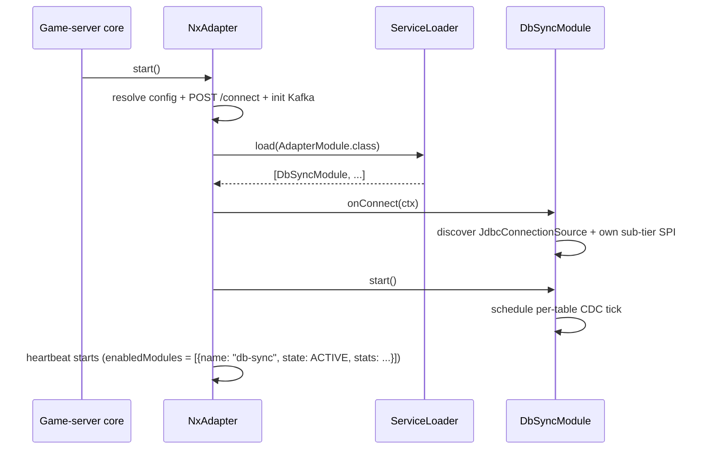

# Adapter Modules — module discovery & registration

> Sibling: [spec.md](./spec.md), [tech.md](./tech.md)
> Audience: anyone implementing an `AdapterModule` impl (db-sync, dp-sync, future
> metrics, custom in-house module) — plus general SPI mechanics that apply to every
> SPI tier in this stack.

This doc walks through how `AdapterModule` impls are discovered by `nx-gs-adapter-core`
at startup. It also covers the general `java.util.ServiceLoader` mechanics that the same
adapter stack reuses at lower SPI tiers (Tier-2 `DbSchemaProvider` in `db-sync`, Tier-3
`JdbcConnectionSource` in `jdbc-connection-source` — but the *mechanics* documented in
"Why ServiceLoader" and "Common mistakes" sections below apply uniformly to all tiers).

## SPI tier landscape

The adapter exposes a layered SPI architecture. **This feature owns Tier 1 only.** Lower
tiers are documented in their respective features:

```
┌─────────────────────────────────────────────────────────────────┐
│                     nx-gs-adapter-api                           │
│                                                                 │
│   public interface AdapterModule {  ◄─── Tier 1 SPI             │
│       String name();                                            │     ← THIS DOC
│       void onConnect(ConnectContext ctx);                       │
│       void start();                                             │
│       void stop();                                              │
│       void onDisconnect();                                      │
│   }                                                             │
└─────────────────────────────────────────────────────────────────┘
                  ▲                                ▲
                  │ implements                     │ implements
                  │                                │
   ┌──────────────┴────────────┐    ┌──────────────┴────────────┐
   │   nx-gs-db-sync-core      │    │   nx-gs-dp-sync-core      │
   │                           │    │   (future)                │
   │   class DbSyncModule      │    │   class DpSyncModule      │
   │     implements            │    │     implements            │
   │     AdapterModule         │    │     AdapterModule         │
   │                           │    │                           │
   │   + Tier-2 SPI internally │    │   + sub-tier SPI          │
   │     (DbSchemaProvider)    │    │     (TBD)                 │
   │                           │    │                           │
   │   + Tier-3 SPI internally │    │                           │
   │     (JdbcConnectionSource)│    │                           │
   └───────────────────────────┘    └───────────────────────────┘
```

**Tier 1** is the **open-core module SPI** — any kind of module (DB sync, datapack
sync, metrics, future) plugs in here. Discovered by `nx-gs-adapter-core` once at
startup.

**Tier 2 / Tier 3** are **internal to specific module stacks** (e.g. `DbSchemaProvider`
in db-sync — schema variants per game-server fork; `JdbcConnectionSource` in
jdbc-connection-source — host pool integration). Each sub-tier is described in its own
feature's `module-discovery.md` (or equivalent). The general SPI mechanics in this
doc — service-descriptor format, no-arg-constructor requirement, failure modes — apply
identically to those tiers; module authors don't need to re-learn the machinery.

Cross-references:

- Tier 2 (db-sync `DbSchemaProvider` discovery, vanilla → client override pattern,
  multi-impl resolution scenarios):
  [`docs/features/db-sync/module-discovery.md`](../db-sync/module-discovery.md)
- Tier 2 (runtime-sync `RuntimeStateProvider` discovery — same ServiceLoader
  mechanics, host-provided in-memory game-state extractors):
  [`docs/features/runtime-sync/spec.md`](../runtime-sync/spec.md)
- Tier 3 (`JdbcConnectionSource` resolution: host SPI Path 1 + bundled-Hikari Path 2
  fallback): [`docs/features/jdbc-connection-source/spec.md`](../jdbc-connection-source/spec.md)
  (full doc; no separate `module-discovery.md` for that tier — content is already in
  spec/tech).

The wire-level contract (descriptor file name = fully-qualified interface name,
no-arg public constructor required, one impl FQN per line) is identical for
every tier and every SPI — only the per-tier resolution rule differs (Tier 1:
one impl per `name()` by convention; Tier 2 / Tier 3: fail-loud on >1).

---

## Tier 1 — `AdapterModule` discovery

### Interface (in `nx-gs-adapter-api`)

```java
package app.l2nx.gs.adapter.api;

public interface AdapterModule {
    String name();                       // unique, e.g. "db-sync", "dp-sync"

    void onConnect(ConnectContext ctx);  // platform handshake done; ctx carries
    // serverId, tenantSlug, kafka producer ref,
    // AdapterConfig

    void start();                        // start running (schedule ticks, etc.)

    void stop();                         // stop ticking; idempotent

    void onDisconnect();                 // release resources (pools, in-memory state)
}
```

### Lifecycle

```
[Game-server JVM boots]
       │
       ▼
[NxAdapter.start()]
       │
       ▼
[ConfigResolver → AdapterConfig]
       │
       ▼
[POST /connect → ConnectResponse]
       │
       ▼
[KafkaInitializer → NxKafka producer ready]
       │
       ▼
[ServiceLoader.load(AdapterModule.class)]   ◄─── Tier-1 discovery point
       │
       │   For every JAR on the host classpath, the JDK reads:
       │     META-INF/services/app.l2nx.gs.adapter.api.spi.AdapterModule
       │   It instantiates each listed class via no-arg constructor and
       │   yields them as Iterable<AdapterModule>.
       ▼
[two-phase connect:
   for each module: SafeRunnable.wrap(module.onConnect(ctx))
   for each module: SafeRunnable.wrap(module.start())]
       │
       ▼
[HeartbeatService — enabledModules = ModuleRegistry.currentStatuses()]
```

### Sequence diagram



### Service descriptor in a module JAR

Inside the published module JAR (e.g. `nx-gs-db-sync-core-X.Y.Z.jar`):

```
META-INF/
└── services/
    └── app.l2nx.gs.adapter.api.spi.AdapterModule
```

Content (one fully-qualified class name per line — typically one impl per JAR):

```
app.l2nx.gs.db.sync.DbSyncModule
```

Source location in the module's repo:

```
nx-gs-db-sync-core/
├── src/main/java/app/l2nx/gs/db/sync/DbSyncModule.java
└── src/main/resources/META-INF/services/
                       └── app.l2nx.gs.adapter.api.spi.AdapterModule
```

### Failure modes

- **No `AdapterModule` on classpath** — `nx-gs-adapter-core` runs with empty
  `enabledModules`. Adapter is connected to the platform and emits heartbeats but does
  no actual work. Operator must add at least one module JAR (e.g.
  `nx-gs-db-sync-core`) to get useful behavior.
- **Module's `onConnect` throws** — caught by `NxAdapter` via `SafeRunnable`, logged
  via `NxLog`. That module transitions to internal `FAILED` state; subsequent
  heartbeat ticks report it as `FAILED`. Other modules continue. The host JVM thread
  is never affected.
- **Module's `start()` throws** — same handling. Module is `FAILED` in heartbeat
  reports.
- **Module's `stop()` / `onDisconnect()` throws (during shutdown)** — logged, ignored
  (already shutting down). Other modules continue their reverse-order shutdown
  sequence.
- **Module's `currentStatus()` per-tick query throws** — heartbeat reports it as
  `{name, state: FAILED}` without crashing the heartbeat tick. Other modules' status
  unaffected.

---

## Why ServiceLoader and not something else

(Applies to Tier 1 here, and equally to Tier 2 / Tier 3 in their respective features.)

- **No reflection scanning** — JDK reads service descriptor files directly; no walking
  every class on classpath. Cheap at startup; classpath size does not affect discovery
  time.
- **No annotations** — adapter targets Java 8; no records, no annotation processors at
  runtime, no `@Component`-style scanning that requires a heavyweight container.
- **No DI container** — adapter embeds in a host JVM whose classpath we don't control.
  Spring, CDI, Guice all bring transitive deps that may clash with the host. ServiceLoader
  ships zero runtime cost beyond a few JDK calls.
- **Operator-discoverable** — the descriptor file is plain text. Anyone unzipping a
  module JAR can read it and understand what the JAR registers. No magic, no surprise
  classpath behavior.
- **Standard JDK feature** — every JDK since 1.6 ships it. No version-skew risk between
  host JVM and the adapter's expectations.

## Common mistakes when authoring a module (any tier)

- **Forgetting the descriptor file.** Class implements the SPI but `ServiceLoader`
  doesn't see it because `META-INF/services/<fqcn>` is missing. Symptom: adapter logs
  "no AdapterModule on classpath" (or the equivalent for whichever tier). Fix: add
  the file under `src/main/resources/META-INF/services/`.
- **Wrong file name.** The descriptor file's name MUST be the fully-qualified
  interface name *exactly* (no `.txt`, no `.list`, no `.services`). For Tier 1 that's
  literally `app.l2nx.gs.adapter.api.spi.AdapterModule` — dots and all. Some IDEs / OS
  filename helpers append extensions automatically; disable that or rename after
  saving.
- **No-arg constructor missing.** `ServiceLoader.load()` instantiates each impl via
  the no-arg constructor by default. Don't add custom constructors that take args.
  If you need args, the SPI tier provides a parameterless lifecycle hook (e.g.
  `AdapterModule.onConnect(ctx)`) where you receive context — not the constructor.
- **Class not `public` or no `public` no-arg constructor.** ServiceLoader-discovered
  classes must be both. Lombok `@AllArgsConstructor` on the class without explicit
  no-arg → ServiceLoader fails with `NoSuchMethodException`.
- **Class loaders on host JVMs with non-trivial hierarchies.** Some hosts (OSGi,
  WAR-in-WAR, agent jars) have weird classloader trees. `ServiceLoader.load()` uses
  the current thread's context classloader by default. `nx-gs-adapter-core` sets the
  context CL to its own loader before invoking `ServiceLoader.load()` to avoid
  host-CL surprises. Module authors don't need to think about this — it's handled in
  adapter-core.
- **Multiple impls accidentally registered.** Each tier has its own selection rule
  (Tier 1: typically one impl per name; Tier 2 / Tier 3: fail-loud on >1 — see
  per-tier docs). Easy mistake: copy-paste a service descriptor between modules
  without updating the FQN inside.
